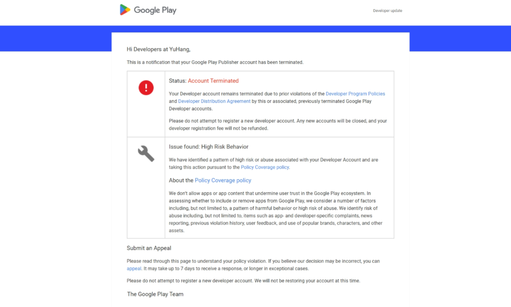
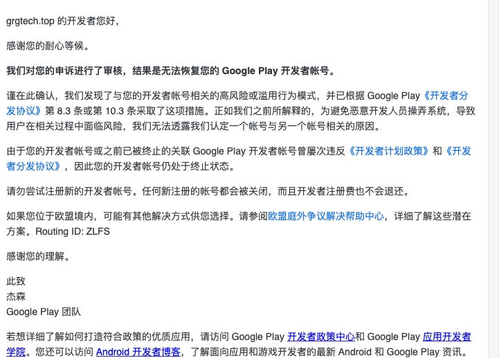
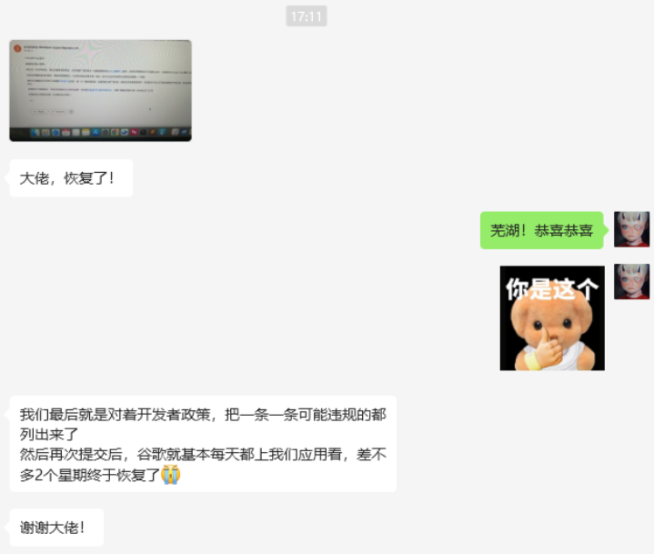
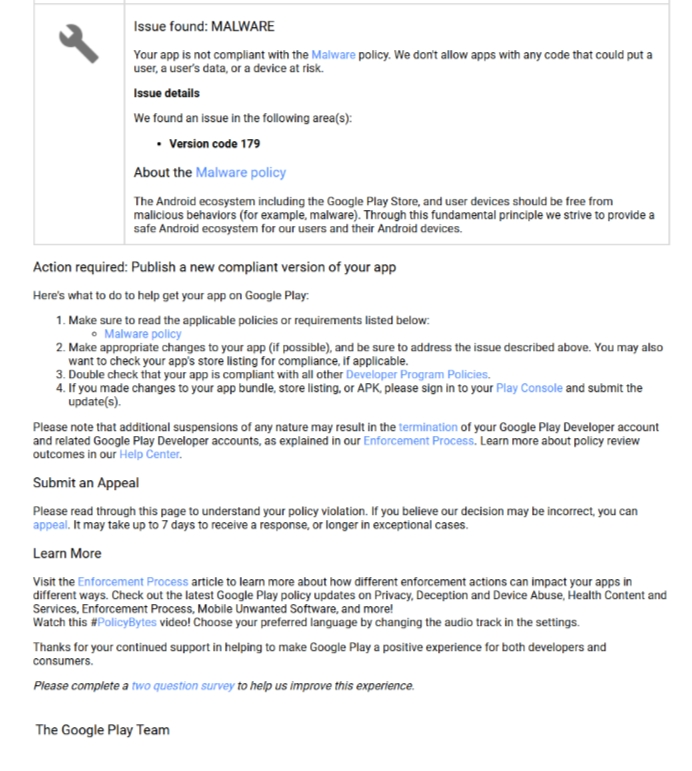
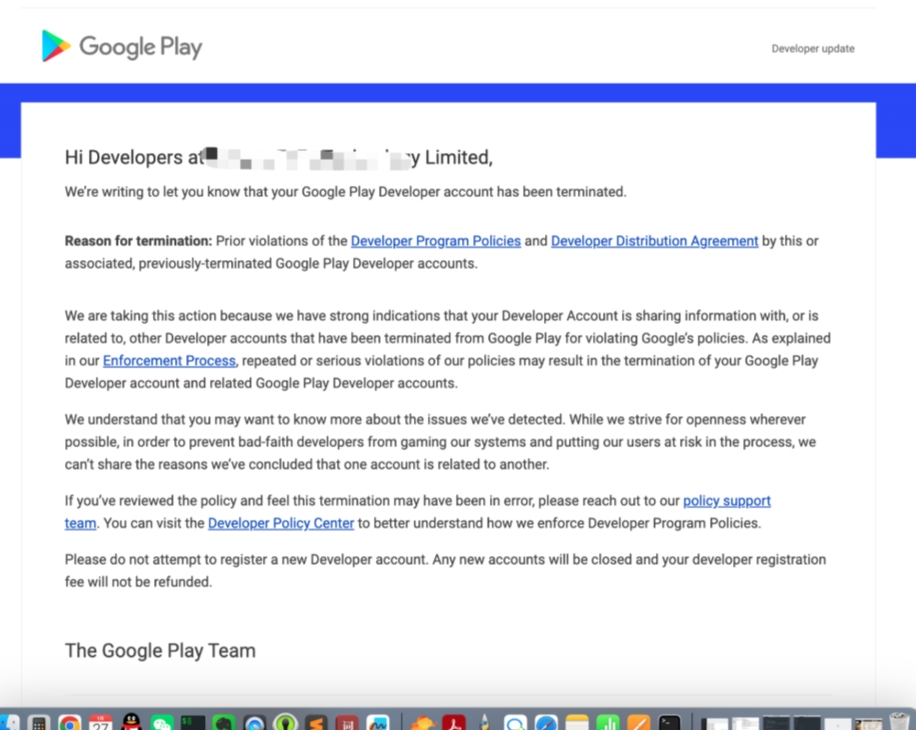
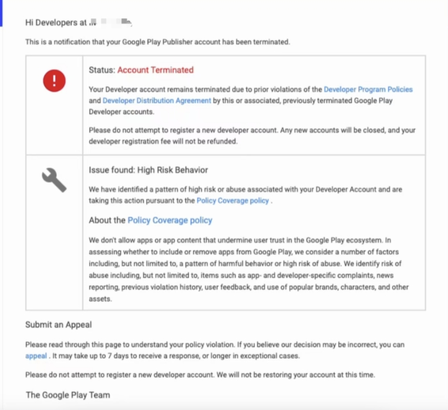
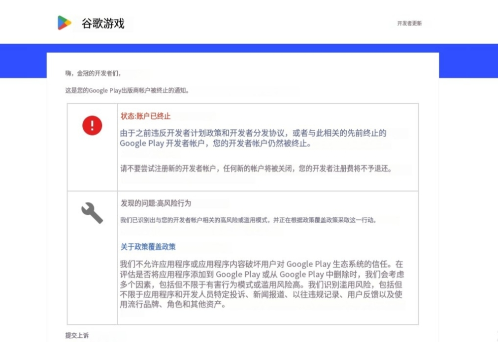
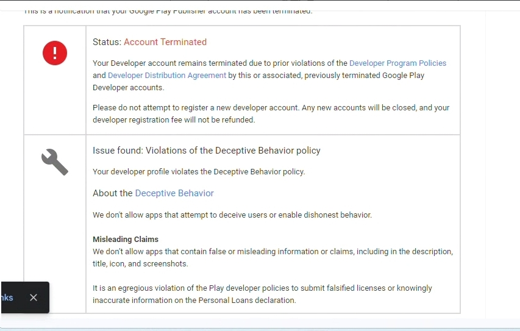

## 这里是一个专门收集大家上架Google Play被应用下架或是账号被封的数据收集库

**本库同步腾讯在线文档：[Android GO出海谷歌封号数据收集库](https://docs.qq.com/sheet/DZldVTnBqeGxFRlBO?tab=BB08J2)**

如果你也想将封号申诉的案例同步到此库，或者寻求封号申诉帮助，[请通过以下问卷链接提供必要信息。](https://wj.qq.com/s2/15600917/8c87/)

**GitHub链接：[Bad-Google-Play](https://github.com/AndroidGODev/Bad-Google-Play)**

或是直接在GitHub上面按照格式要求填写提交PR，审批没问题就直接合并。

### 关于我

为方便大家了解和查看出海市场上的“惨烈”状况，特建立此库用于记录。让大家有一个直观的数据看到目前为止出海的情况到底是乐观的还是悲观的。

无论你是刚做出海的菜鸟，还是已经出海多年的大牛，相信也被同样的问题困惑，Google Play到底何时才能“罢休”？市场上腥风血雨，GP以一己之力，搅得整个出海环境都尤为严格，不单单是Google Play，连带Facebook和其他出海平台的审核也一起严格、卡审了！不少人认为，这是一轮针对国人的不公平政策，但是大家也无可奈何，只能不停地找方法去上架。

虽说市场上肯定有部分不为好意，寻找漏洞的投机分子在破坏应用商店，但是请Google也要知道，目前还是有不少开发者确实是被冤枉的，而这部分开发者，牢鹅相信大家还是在认真做产品的。你们的一次“误”封号，可能就会造就一个小团队好几个月的白费开发而导致倒闭。

欢迎大家添加牢鹅的微信：**kris_wuii**，然后提供相关资料，让我们一起完善此库，为国人出海出一份力。也可以直接提交PR，按照格式填写内容即可，审核没问题就直接merge。也欢迎加入我的GP出海交流群，一起交流学习。（此群主要面向交流谷歌政策、账号和上架问题的朋友，同时分享行业信息资源）

废话说多了，但都是肺腑之言，直接下拉看数据：

:x: 为不予解封
:ballot_box_with_check:	 为解封成功
:yellow_circle:	 为等待回复

|                    截图1                    | 截图2(可空)                                 | 问题描述                                                     | 处理过程                                                     | 最终结果                               | 应用类型 |
| :-----------------------------------------: | ------------------------------------------- | ------------------------------------------------------------ | ------------------------------------------------------------ | -------------------------------------- | -------- |
|  |  | 25年4月自行注册的**英国**企业账号（虚拟卡），物理机环境 高风险 | 2025年4月17日 注册号开发者账号，同步提包 2025年4月20日 高风险封号，还未申诉   准备首轮申诉中 | :yellow_circle: | 社交类 |
|  |  | 25年3月自行注册的大陆企业账号（实体卡），VPS环境 高风险 | 2025年3月28日应用上架 2025年4月3日 高风险账号被移除 2025年4月9日 应用第一轮申诉 | :yellow_circle: | 社交类 |
|  |  | 三方购买的21年10月巴西企业账号（实体卡），VPS环境 屡次违规 | 2025年3月7日 提了个close包 2025年3月10日 审核通过 2025年3月10日 提了相同的包到publish正式包 2025年3月12日 账号被封 2025年3月12日 申诉 2025年4月9日 被驳回 | :x: | 游戏类 |
|  |  | 24年5月自行注册的大陆企业账号（实体卡），VPS环境 屡次违规 | 2025年4月初 上架提审一个小游戏包 2025年4月7日 被高风险封号 2025年4月8日 开始申诉 | :yellow_circle: | 游戏类 |
|  |  | **20年2月**自行注册的香港企业账号（**虚拟卡**），VPS环境 高风险 | 2025年3月21日 收到谷歌封号通知 2025年3月22日 自查并进行申诉 2025年4月1日 收到谷歌不予解封通知“您的開發人員帳戶或其他已遭終止的相關 Google Play 開發人員帳戶” | :x: | 游戏类 |
|  |  | 24年6月自行注册的大陆企业账号（实体卡），VPS环境 高风险 | 2025年4月3日 上架审核 2025年4月4日 高风险行为封号 2025年4月7日 提交申诉 | :yellow_circle: | 游戏类 |
|  |  | 25年2月自行注册的**越南**企业账号（实体卡），物理机环境 谷歌8.3 | 2025年3月21日 新包送审 2025年3月28日 新号被封 | :x: | 金融类 |
|  |  | 24年12月自行注册的香港企业账号（实体卡），本地VPN环境 高风险 | 2025年1月6日 应用提审 2025年1月7日 应用审核上架 2025年1月24日 高风险行为下架 2025年2月8日 首轮申诉 2025年2月26日 2轮申诉，解封成功 | :ballot_box_with_check: | 工具类 |
|  |  | 25年2月自行注册的大陆企业账号（实体卡），物理机环境 高风险 | 暂未申诉 | :x: | 工具类 |
|  |  | 24年10月自行注册的大陆企业账号（实体卡），VPS环境 高风险 | 2025年3月5日 上架提审 2025年3月7日 政策状态提示：应用遭到封停，当天状态变更为：账号已移除，邮件提示高风险 2025年3月9日 申诉 至今未回 | :yellow_circle: | 社交类 |
|  |  | **购买的23年7月的巴西企业账号**（实体卡），VPS环境 高风险 | 2025年3月7日 应用提交开放测试版本 2025年3月10日 测试版本审核通过 2025年3月10日 同版本提审到正式服 2025年3月12日 账号高风险被封禁 2025年3月12日 提交首轮申诉，至今未回复 | :yellow_circle: | 游戏类 |
|  |  | 25年2月自行注册的香港个人账号（实体卡），**物理机** 高风险 | 2025年2月26日 新注册了账号 2025年3月12日 提交审核第一个包 2025年3月17日 收到高风险封号的邮件  准备首轮申诉中 | :yellow_circle: | 工具类 |
|  |  | 24年10月自行注册的**美国**企业账号（实体卡），VPS环境 高风险 | 发邮件申诉过一次，没成功 | :x: | 工具类 |
|  |  | **23年2月**自行注册的大陆企业账号（实体卡），本地VPN环境 屡次违规 | 2023年4月 App上架 2024年10月4日 账号因屡次违规被封禁了 2024年10月20日 开始第一次申诉，谷歌回复的结果就是关联违规账号 | :x: | 工具类 |
|  |  | **23年10月**自行注册的香港企业账号（实体卡），VPS环境 屡次违规 | 期间申诉过几次，谷歌均未解封 | :x: | 金融类 |
|  |  | **18年6月自行注册的香港个人账号（虚拟卡）**，VPS环境 谷歌8.3/恶意软件 | 申诉背景：账号原来有一个休闲游戏一直正常更新。 **2024年6月（被封申诉）** 新提交了一个应用，审核直接被8.3邮件回复，然后封号。随后后台申诉一次，被驳回。谷歌再次邮件回复依旧是已经掌握**确凿违规证据，不予解封**。 **2024年11月 （重启申诉）** 中间遂放弃了，过了5个月时间，看到大部分人能申诉通过，又给Google developer发了一封解封申诉邮件，3天后谷歌回信需要填表单申诉，11月15日填完表单后一直没有消息。11月29日谷歌回信要重新告知他们一个测试账号用于测试被封应用。 **2025年3月（解封成功）** 随后一直没有消息，等待了4个月时间，2025年3月16日终于收到解封邮件。 | :ballot_box_with_check: | 游戏类 |
|  |  | 24年12月自行注册的香港企业账号（实体卡），VPS环境 高风险 | 2024年12月 账号注册成功之后，放了两个多月 2025年3月10日 应用提审 2025年3月14日收到高风险行为封号 尚未申诉 | :yellow_circle: | 金融类 |
|  |  | 24年12月自行注册的香港企业账号（实体卡），本地VPN环境 高风险 | 2025年3月3日 提交开放测试 2025年3月6日 过审， 发了一个IARC评级邮件没处理，需要恢复轨道，再次正式版本审核。 2025年3月10日 账号被封，高风险 还未提交申诉 | :yellow_circle: | 游戏类 |
|  |  | 25年1月自行注册的香港企业账号（实体卡），本地VPN环境 高风险 | 2025年3月2日 提审 2025年3月4日 账户被封，高风险  2025年3月6日 首轮申诉 2025年3月10日 回复不予解封 | :x: | 工具类 |
|  |  | 24年6月自行注册的大陆企业账号（实体卡），**自己搭的专线环境** 高风险 | 2024年7月 应用通过审核上架 2024年9月6日 收到封禁邮件，理由为高风险 2024年9月11日 第一次提交申诉 2024年9月12日 反馈不予解封 2024年9日14月 再次提交申诉，不予解封 2024年9月25日 第三轮申诉，不予解封 2024年10月2日 第四轮申诉，不予解封 2025年1月13日 第五轮申诉，不予解封 | :x: | 游戏类 |
|  |  | 25年2月自行注册的大陆企业账号（实体卡），VPS环境 屡次违规 | 2025年2月18日 注册账号：企业开发者账号已提交，等待验证； 2025年2月24日 谷歌网站验证及应用资料上传，账号身份验证完毕  2025年2月25日 提交应用审核 2025年3月3日 邮件提示违规，账号被封“屡次违规” 2025年3月4日 拒接申诉请求，回复谷歌8.3 | :x: | 工具类 |
|  |  | 25年2月自行注册的香港企业账号（实体卡），**本地物理机** 谷歌8.3 | 2025年1月7日 应用第一次申请上架时，使用的是公司同事账号，然后因为REOUEST_INSTALL_PACKAGES权限问题，APP被下架了，提交申诉 2025年1月10日 官方回复可以通过修改包名和包名称，重新提交应用 2025年2月24日 应用第二次申请上架时，使用的是新建账号，因为违反Google8.3和10.3协议，被封号 2025年2月25日 进行邮件申诉，至今未回复 | :yellow_circle: | 工具类 |
|  |  | **22年**自行注册的大陆企业账号（实体卡），本地物理机 高风险 | 2025年2月28日 高风险封号 2025年3月1日 首轮申诉，暂无结果 | :yellow_circle: | 游戏类 |
|  |  | **22年12月**自行注册的大陆企业账号（实体卡），VPS环境 高风险 | 2022年12月 注册的账号 2023年4月 上架应用，中间陆陆续续迭代了一些版本 2024年2月28日 高风险行为封号 申诉中 | :yellow_circle: | 社交类 |
|  |  | 25年2月自行注册的**墨西哥**企业账号（实体卡），VPS环境 屡次违规 | 2025年2月19日 应用提审 2025年2月25日 审核通过上架 2025年2月27日 屡次违规封号 正在准备申诉材料 | :yellow_circle: | 金融类 |
|  |  | 25年1月自行注册的香港企业账号（实体卡），VPS环境 高风险 | 2024年12月31日 使用个人开发者老号提审，成功过审上架 2025年2月11日 将应用从个人开发者老号转移至香港企业开发者新号 2025年2月14日 版本更新 2025年2月20日 再次版本更新 2025年2月26日 高风险行为封号 2025年3月27日 解封成功 | :ballot_box_with_check: | 社交类 |
|  |  | 24年6月自行注册的大陆企业账号（实体卡），本地VPN环境 高风险 | 2024年12月25日 第一次申诉失败 2024年12月26日 第二次申诉失败 | :x: | 游戏类 |
|  |  | 24年8月自行注册的大陆企业账号（实体卡），本地VPN环境 恶意软件 | 2024年8月 应用被下，因为里面oss功能涉及问题，整改后重新上架。  2024年9月 更新应用再次被下架，恶意软件 2024年9月15日 账号因谷歌8.3被封 | :x: | 工具类 |
|  |  | 25年2月自行注册的**英国**企业账号（实体卡），**本地物理机**环境 高风险 | 未进行申诉 | :yellow_circle: | 游戏类 |
|  |  | 25年1月自行注册的香港企业账号（实体卡），VPS环境 高风险 | 2025年2月13日 账号高风险被封，目前还在申诉。(被封背景是在做账号APP转移，APP转移成功，在配置支付配置时候被封的)  第一轮申诉结果不予解封 目前正在进行第二轮 | :yellow_circle: | 短剧类 |
|  |  | 24年11月自行注册的大陆企业账号（实体卡），**指纹浏览器+VPS环境** 高风险 | 2024年12月18日 提交正式版 2024年12月23日 收到邮件填写表单 Information Request 2024年12月24日 拒审，设备 ID 权限未声明，修改并重新提交 2025年1月7日 由于等待太久，再次创建了新包名的App提交，代码和老包一样 2025年1月15日 取消老包审核了，只留 7 号新包审核 2025年2月6日 再次提交老包，首次提交到现在催审了4次，每次回复都是让等待。 2025年2月9日 账号终止：高风险行为 2025年2月9日 提交申诉 2025年2月12日 申诉被拒：8.3或10.3 后续进一步申诉 | :yellow_circle: | 工具类 |
|  |  | **22年6月自行注册的哥伦比亚企业账号（虚拟卡），物理机环境**  **恶意软件** | 2024年9月19日 成功发布最后一个版本 2024年10月6日 APP被Suspended（封停），邮件内容是Malware（恶意软件） 2024年10月10日 Play Console后台提交申诉 2024年10月10日 Google邮件回复，“During our review, we found that your app violates the Spyware policy”，并建议我们用账号创建新包。 2024年10月10日 再次申诉，并给出了权限这块的后续优化方案。 2024年10月12日 Google邮件回复：明确我们的app是违反了spyware政策。  2024年10月17号-2024年11月6日 期间10次沟通申诉，询问申诉进展 至今仍未回复 | :yellow_circle: | 金融类 |
|  |  | 24年10月自行注册的大陆企业账号（实体卡），VPS环境 高风险 | 2024年10月11日 高风险行为封号 2024年10月12日 提交首次申诉 2024年11月8日 拒绝恢复 2024年11月11日 再次申诉 2024年11月25日 再次拒绝 | :x: | 工具类 |
|  |  | 24年1月自行注册的香港企业账号（实体卡），VPS环境 高风险 | 2025年1月13日 申请的香港企业开发者账号 2025年1月16日 提交开放性测试过审 2025年1月29日 封号高风险 2025年2月7日 第一轮申诉，待回复 | :yellow_circle: | 短剧类 |
|  |  | **23年8月自行注册的菲律宾企业账号**（实体卡），本地VPN环境 谷歌8.3 | 2025年2月7日上午8点03分 应用因恶意软件被下架； 2025年2月7日上午10点03分 申诉； 2025年2月7日上午11点48分 开发账号被移除（谷歌8.3）； 2025年2月7日下午13点45分，再次申诉； | :yellow_circle: | 工具类 |
|  |  | 24年7月自行注册的香港企业账号（实体卡），本地VPN环境 高风险 | 2025年1月20日 提交内测，内测通过 2025年1月23日 提交封测和正式测试 2025年1月31日 账号高风险被移除，所有应用均从Google Play下架 2025年2月5日 首轮申诉，拒绝 2025年2月11日 二轮申诉，成功解封 2025年2月14日 产品上架 | :ballot_box_with_check: | 社交类 |
|  |  | 24年8月三方购买的**巴基斯坦企业账号**（实体卡），本地VPN环境 高风险 | 2025年2月1日 提交审核 2025年2月3日 账号被封，高风险 2025年2月4日 申诉 2025年2月4日 驳回，无法解封 | :x: | 社交类 |
|  |  | 23年10月自行注册的香港企业账号（实体卡），**物理机环境** 高风险 | 在提交公测的时候账号被封了，目前第一轮申诉刚递交，还没有回复结果 | :yellow_circle: | 游戏类 |
|  |  | **18年**自行注册的**香港个人账号**（实体卡），本地VPN环境 谷歌8.3 | 申诉一轮 不予解封 | :x: | 游戏类 |
|  |  | 24年11月自行注册的大陆企业账号（实体卡），VPS环境 高风险 | 2025年1月1日 提交封闭测试 2025年1月16日 封闭测试结束并申请正式版发布权限 2025年1月18日 获得正式版权限，提审正式轨道发布 2025年1月19日 高风险封号 2025年1月19日 申诉 2025年1月23日 申诉驳回 | :x: | 游戏类 |
|  |  | 24年10月自行注册的大陆企业账号（实体卡），VPS环境 高风险 | 2024年10月12日 提交游戏 2024年10月20日 账号被封 2024年12月10日 提出首轮申诉 2024年1月10日 申诉被驳回。 准备继续申诉 | :yellow_circle: | 游戏类 |
|  |  | 25年1月自行注册的大陆企业账号（实体卡），本地VPN环境 高风险 | 2025年1月14日 应用提审 2025年1月17日 高风险行为封号 2025年4月7日 申诉4轮，解封成功 | :ballot_box_with_check: | 游戏类 |
|  |  | 24年11月自行注册的塞尔维亚企业账号（虚拟卡），本地VPN环境 高风险 | 2025年1月9日 APP 送审 2025年1月1月13日 高风险行为封号 2025年1月1月13日 首轮申诉 2025年1月1月16日 再次申诉  准备第三次申诉中 | :yellow_circle: | 工具类 |
|  |  | 24年11月自行注册的大陆企业账号（实体卡），远程物理机 高风险 | 2024年12月18日 新应用审核被拒 2024年12月20日 提申诉被拒 后续注册新账号，二次上架(环境隔离)，提审再次被拒 | :x: | 工具类 |
|  |  | 24年12月自行注册的大陆企业账号（实体卡），本地VPN 高风险 | 上线20天了，期间更新了好几个版本，突然被封的  申诉中 | :yellow_circle: | 工具类 |
|  |  | 24年12月自行注册的大陆企业账号（实体卡），本地VPN 高风险 | 2025年1月7日 预审通过 2025年1月8日 提交开放式测试轨道  2025年1月9日 高风险行为封号，当日申诉 2025年1月10日 驳回，根据8.3或10.3，当日进行第二轮申诉 2025年1月14日 无消息又补提了一封自查后的申诉邮件，目前等待消息中 | :yellow_circle: | 游戏类 |
|  |  | 24年9月自行注册的**非洲**企业账号（实体卡），**远程物理机** 高风险 | 2024年11月19日 应用通过审核上架 2024年11月25日 高风险封号 2024年12月10日 首轮申诉，官方回复案件审核进行中 2024年12月24日 次轮申诉，无回复 2025年1月9日, 三轮申诉+催审核, 回复 8.3/10.3 | :x: | 金融类 |
|  |  | **23年6月三方购买的巴基斯坦个人账号**（实体卡），本地VPN环境 高风险 | 封号背景：2024年10月24日、10月29日、11月1日、11月4日、11月8日、11月14日多次更新包体内容，修改使用权限和功能尝试上架，都失败。最后一次提交时立马账号高风险下架。  2024年11月20日 后台提交申诉 2024年12月30日 才给了第一次回复，是拒绝。 2025年1月8日 邮件再次发送邮件申诉 2025年1月10日 回复拒绝。 下架至今约2个月，经历2轮，准备第3轮申诉 | :yellow_circle: | 工具类 |
|  |  | 24年12月自行注册的大陆企业账号（实体卡），VPS环境 高风险 | 2024年12月30日 APP提交审核 2024年12月31日 高风险行为封号 2025年1月3日 第一次申诉 2025年1月10日 申诉被拒，开始二轮申诉 | :yellow_circle: | 工具类 |
|  |  | 24年12月自行注册的大陆企业账号（实体卡），本地VPN环境 高风险 | 2025年1月6日 APP提审 2025年1月8日 应用被拒，隐私权政策无效，修改后再次提交 2025年1月10日 高风险行为封号 2025年1月10日 第一次申诉 2025年1月13日无法恢复账号，回复谷歌8.3或10.3 2025年1月20日 二轮申诉成功 | :ballot_box_with_check: | 工具类 |
|  |  | 24年1月自行注册的香港企业账号（实体卡），本地VPN环境 高风险 | 2025年1月3日 提审Open test轨道 2025年1月6日 过审，但是未转到Production轨道 2025年1月6日 提审增加Open test的Feedback邮箱 2025年1月7日 高风险被封 2025年1月7日 第一轮申诉 | :yellow_circle: | 社交类 |
|  |  | 25年1月**三方**注册的美国企业账号（**虚拟卡**），VPS环境 高风险 | 2025年1月6日 提交上架 2025年1月7日 上午出现封号邮件,邮件显示高风险封号 | :x: | 社交类 |
|  |  | 24年11月自行注册的大陆企业账号（实体卡），本地VPN环境 高风险 | 2024年12月18日上架1.0版本，一直审核中 2024年12月28日 撤回1.0版本，重新上架1.1 2024年12月31日 高风险行为封号 2024年12月31日 首轮申诉，暂无结果 | :yellow_circle: | 工具类 |
|  |  | 24年5月自行注册的**印尼**企业账号（实体卡），VPS环境 高风险 | 2024年10月28日 APP提审赞比亚 市场 2024年12月20日 过去俩月一直审核中，撤回提审，重新发起审核 2024年12月21日 账号被移除（高风险） 经过多轮申诉，从高风险到谷歌8.3或10.3 | :x: | 工具类 |
|  |  | 24年10月自行注册的香港企业账号（实体卡），VPS环境 高风险 | 2024年9月12号 开通账号 2024年9月18号 提审 2024年9月19号 高风险封号  **期间申诉三轮，均被驳回** | :x: | 游戏类 |
|  |  | **21年**自行注册的非洲企业账号（实体卡），本地VPN环境 **违反金融服务政策** | 2024年10月 产品过审上架 2024年12月24日 违反金融服务政策产品暂停，有马甲包上架历史 2024年12月25日 首轮申诉被拒 | :x: | 金融类 |
|  |  | **22年11月**自行注册的香港企业账号（实体卡），本地VPN环境 高风险 | 2024年11月16日 应用提包都很正常，很快过审通过 2024年11月23日 高风险行为封号 2024年11月24日 第一轮申诉，拒绝解封 ... 期间历经四轮申诉 ...  2025年2月22日 提交第四轮申诉 2025年2月24日 解封成功 | :ballot_box_with_check: | 社交类 |
|  |  | 24年10月自行注册的**越南**企业账号（实体卡），VPS环境 屡次违规 | 2024年10月23号被封号 截至目前45天里申诉邮件发了4次，申诉至今无结果 | :x: | 金融类 |
|  |  | **23年3月**自行注册的大陆个人账号（实体卡），本地VPN环境 屡次违规 | 2024年7月10日 收到账号因屡次违规被封邮件 。其账号有多款上架应用，在此之前有因为各种原因App暂停的违规 2024年7月12日 发起申诉 2024年7月16日 收到邮件回复，申诉未通过  2024年12月31日重新尝试申诉，等待申诉结果 | :yellow_circle: | 工具类 |
|  |  | 24年7月自行注册的**日本**企业账号（实体卡），物理机环境 谷歌8.3 | 2024年7月19日 游戏第一次提交审核 2024年7月22日 14:55 提示应用已获批准，但无法在某些国家或地区发布 2024年7月22日 15:27 应用已被暂停并删除 2024年7月22日 16:58 应用被谷歌人工审核 2024年7月22日 18:36 违反《开发者分发协议》第8.3条和开发者计划政策账户终止 2024年7月23日 17:30 提交申诉 2024年7月23日 19:16 收到回复 违反欺骗行为政策 无法恢复 2024年12月28日 重启二轮申诉，等待申诉结果 | :yellow_circle: | 游戏类 |
|  |  | **23年8月**自行注册的**新加坡**企业账号（实体卡），VPS环境 屡次违规 | 2024年10月17日 收到谷歌的开发者邮件，账号已移除。 2024年10月18日 我们第一次进行了版权内容的申诉，并提供了内容版权文件。 2024年10月30日 我们第一次提交账号的申诉 2024年11月19日 期间催审，收到谷歌的邮件，依旧是等待。 2025年1月8日 申诉成功 | :ballot_box_with_check: | 阅读类 |
|  |  | 24年12月自行注册的香港企业账号（实体卡），物理机环境 高风险 | 2024年12月18日 应用送审内测 2024年12月23日 通过内测 2024年12月23日 提交正式版本 2024年12月24日 提示高风险  准备首轮申述 | :yellow_circle: | 社交类 |
|  |  | 24年12月自行注册的**越南**企业账号（实体卡），物理机环境 高风险 | 2024年12月3日 开发者注册成功 2024年12月11日 App首次提审 2024年12月18日 谷歌邮件通知App描述文案、安装icon有误 2024年12月20日 再次提审 2024年12月22日 谷歌邮件通知高风险，账号终止 2024年12月28日 提交首轮申诉 | :yellow_circle: | 工具类 |
|  |  | 24年11月自行注册的香港企业账号**（虚拟卡）**，本地VPN环境 高风险 | 2024年12月12日 提交审核应用 2024年12月14日 高风险行为封号 2024年12月14日 提交首轮申诉 2024年12月18日 申诉驳回 2024年12月18日 第二次申诉 正在等待第二次申诉结果 2025年1月3日 解封成功 | :ballot_box_with_check: | 休闲游戏 |
|  |  | 24年11月自行注册的大陆企业账号（实体卡），VPS环境 高风险 | 2024年12月3号 应用提交审核 2024年12月5号 账号高风险 2024年12月6号 提交首轮申诉 2024年12月8号驳回 2024年12月8再次申诉 2024年12月9号二轮驳回 2024年12月10号提交详细资料申诉 2024年12月15 三轮驳回 | :x: | 工具类 |
|  |  | 24年11月自行注册的大陆企业账号（实体卡），VPS环境 高风险 | 2024年12月10日提交审核  2024年12月13日高风险行为封号  2024年12月21日 首轮申诉驳回  2024年12月22日 提交第二轮申诉 | :yellow_circle: | 阅读类 |
|  |  | 24年10月自行注册的菲律宾企业账号（实体卡），库鸟云环境 高风险 | 10月份 注册的开发者账号  11月中旬 提审  11月25日 成功上架  12月12日 高风险账号被封  12月13日 首轮申诉 | :yellow_circle: | 金融类 |
|  |  | **22年**自行注册的大陆个人老账号（实体卡），本地VPN环境 屡次违规 | 2024年9月30日 送审被拒说是恶意软件(实际上就是正常的休闲游戏)，之后修改描述；送审2次“屡次违规”被封， 首轮申述后，不予解封；   2024年12月11日尝试第二轮申诉  2025年1月4日 解封成功 | :ballot_box_with_check: | 休闲游戏 |
|  |  | 24年9月自行注册的香港企业账号（实体卡），本地VPN环境 高风险 | 11月15日 账户被终止   11月21日 提交申诉   11月24日 谷歌回复不予解封 | :x: | 阅读类 |
|  |  | **23年3月**自行注册的菲律宾企业账号（实体卡），VPS环境 违规金融服务政策 | 2023年3月20号 应用上线   2024年6月15号 账户被封(谷歌8.3)  2024年6月20号 申诉   2024年7月9号 解封   2024年12月9号 账户被封(违反金融服务政策)   2024年12月9号 提交首轮申诉 | :yellow_circle: | 金融类 |
|  |  | 24年6月自行注册的大陆个人账号（实体卡），本地VPN环境 高风险 | 未申诉 | :x: | 社交类 |
|  |  | 24年7月自行注册的香港企业账号（实体卡），本地VPN环境 屡次违规 | 11月29日 提交正式包3个小时后，账号被封禁，提示重复违规 准备申诉中 | :yellow_circle: | 社交类 |
|  |  | 23年8月自行注册的新加坡企业账号（实体卡），本地VPN环境 屡次违规 | 5月9日 账号移除 5月11日 首轮申诉 6月12日 驳回上诉 | :x: | 工具类 |
|  |  | 24年10月购买的大陆个人账号（实体卡），VPS环境 高风险 | 首轮申诉失败 | :x: | 休闲游戏 |
|  |  | 24年9月自行注册的香港企业账号（实体卡），本地VPN环境 高风险 | 11月5日 应用提交审核 11月13日 催审，填安全表单 11月14日 Google账号被封，高风险 11月15日 尝试首轮申诉 | :yellow_circle: | 休闲游戏 |
|  |  | 24年6月自行注册的新加坡企业账号（实体卡），本地VPN环境 屡次违规 | 10月初提交测试包，长时间未过审 10月29日 账户终止，原因：多次违规 10月29日 申诉，收到申诉邮件后回复邮件 目前依旧未解封 | :x: | 短剧类 |
|  |  | 24年7月自行注册的大陆企业账号（实体卡），本地VPN环境 高风险 | 8月15日，提审 8月21日，高风险行为封号 8月21日下午，第一次申诉 8月24日，无法恢复账号：第 8.3 条或第 10.3 条 9月9日，第二次申诉 9月9日，无法恢复账号：我们确实发现了与您的开发者帐号相关的高风险或滥用行为模式。很抱歉，我们无法透露我们认定一个帐号与另一个帐号相关的原因。 10月30日，第三次申诉 11月8日，申诉成功：经过进一步的审核后，我们已接受您的申诉，并且恢复了您的帐号。 历时两个多月，三轮申诉成功 | :ballot_box_with_check: | 社交类 |
|  |  | 24年8月自行注册的香港企业账号（虚拟卡），本地VPN环境 高风险 | 8月29日 注册谷歌开发者账号 11月2日 提审应用 11月5日 高风险或滥用行为原因封号 11月5日 开发者后台提交第一次申诉 11月7日 谷歌邮件反馈申诉失败 11月7日 二轮提交申诉目前暂无邮件回复 | :yellow_circle: | 社交类 |
|  |  | 24年10月自行注册的非洲企业账号（实体卡），远程物理机环境 高风险 | 10月17日 注册账号 11月1日 提审白包 11月5日 高风险封号 目前自查准备申诉中 | :yellow_circle: | 金融类 |
|  |  | 24年8月自行注册的香港企业账号（实体卡），本地VPN环境 高风险 | 8月份 提交上架 9月份 账号高风险 11月份 提交首轮申诉 | :yellow_circle: | 休闲游戏 |
|  |  | 24年9月自行注册的大陆个人账号（实体卡），本地VPN环境 高风险 | 10月12日 提交上架审核 10月28日 高风险账号被封 暂未进行申诉 | :yellow_circle: | 工具类 |
|  |  | 24年4月自行注册的大陆企业账号（虚拟卡），指纹浏览器环境 高风险 | 4月1日 申请谷歌开发者账户 10月12日 提审上架审核 10月16日 高风险行为邮件 10月23日 提交首轮申诉 10月28日收到谷歌回复说不予解封根据8.3和10.3条采取了这项措施 11月31日 提交二轮申诉 | :yellow_circle: | ARPG游戏 |
|  |  | 24年5月自行注册的大陆个人账号（实体卡），VPS环境 高风险 | 9月22日 高风险账号封号 暂未进行审核 | :yellow_circle: | 工具类 |
|  |  | 24年10月自行注册的大陆企业账号，本地VPN环境 高风险 | 10月21日提交上架 10月23日补交资料 10月24日高风险封号 目前自查申诉中 | :yellow_circle: | 休闲游戏 |
|  |  | 24年9月自行注册的大陆企业账号，云服务器 高风险 | 10月11日应用提审 10月16日高风险行为封号 10月17日 首次申诉驳回 11月10日 第三轮申诉解封成功 | :ballot_box_with_check: | 工具类 |
|  |  | 24年9月自行注册的香港企业账号，VPS环境 高风险 | 9月30首次提包 10月1日标记高风险封号 10月17日提申诉 10月24日解封，申诉1轮成功 | :ballot_box_with_check: | 休闲游戏 |
|  |  | 24年5月自行注册的大陆企业账号，VPS环境 高风险 | 5月26号提审 5月27号高风险行为封号 截至目前尝试多次申诉无果 | :x: | 休闲游戏 |
|  |  | 24年10月自行注册的香港企业账号，VPS环境 高风险 | 10月16日注册账号 10月17日提交应用审核 10月18日收到高风险账户邮件 10月21日首轮申诉驳回 | :x: | 工具类 |
|  |  | 23年8月自行注册的大陆个人账号，本地VPN环境 高风险 | 8月29日提审 9月2号封号 9月10号首轮申诉，回复无法恢复 9月16号次轮申诉，相同回复驳回 | :x: | 工具类 |
|  |                                             | 24年8月注册的非洲地区企业账号，部署在当地物理机环境 高风险（违反欺骗行为） | 8.27开始提审 9月23日收到高风险封号提示                  | :x:      | 金融类   |
|  |                                             | 24年4月注册的大陆个人账号，云服务器环境 高风险          | 9.22封号 9.30号申诉 10.7回复不予解封 10.8再次申诉等待结果 | :yellow_circle:         | 工具类   |
|  |                                             | 三方购买21年的巴勒斯坦地区个人老账号，库鸟云环境 高风险（多次违规） | 10月9号高风险行为封号 10月9号提交第一轮申诉，暂无答复   | :yellow_circle:         | 工具类   |
|  |                                             | 23年1月大陆地区个人账号，VPS环境 恶意软件 欺诈行为      | 10月11日应用被下架 提交工单与谷歌沟通，暂未申诉         | :yellow_circle:         | 休闲游戏 |
|  |                                             | 24年9月注册的大陆企业账号，VPS环境 高风险               | 2024.10.1提审 2024.10.3日收到账号终止通知 自查准备申诉中 | :yellow_circle:         | 阅读类   |
|  |  | 24年8月注册的香港企业账号，库鸟云环境 高风险            | 2024.10.3日收到账号终止通知   2024.10.10日提交首轮申诉 2024.10.15 【8.3 0r 10.3】 驳回申诉 2024.10.30 二轮申诉成功 | :ballot_box_with_check: | 健身类   |
|  |                                             | 23年之前的账号，vps环境，上架的是游戏白包。 初次上架直接就高风险。 | 提交一次申诉                                                 | :x:      | 卡牌游戏 |
|  |  | 24年的企业号，vps环境，第一次上包就违反开发者计划            | 提交一次申诉(回复是8.3违规)                                  | :x:      | 工具类   |
|  |                                             | 24年企业号，vps环境上包，一上包就挂了                        | 提交一次申诉                                                 | :x:      | 短剧     |
|  |  | 22年的个人号，上架已有一段时间，后面更新版本，一开始先收到邮件说应用下架，说该版本部分功能无效，然后就尝试更新一个版本，结果直接就把号给封了。 | 提交多次申诉，扯皮无效                                       | :x:      | 阅读类   |
|  |  | 恶意软件导致谷歌8.3封号                                      | 自查申诉命中封号原因，历时7天1轮                             | :ballot_box_with_check: | 休闲游戏 |
|  |  | 24年香港企业账号，本地VPN环境，恶意代码导致谷歌8.3           | 8月2日收到账号终止邮件 9月11日账号解封成功 历时1个月零9天，8轮申诉 | :ballot_box_with_check: | 休闲游戏 |
|  |  | 24年香港企业账号，VPN本地环境，高风险导致谷歌8.3             | 8月17日应用通过审核上架 8月21日高风险行为封号 8月30日解封成功 历时9天，2轮申诉 | :ballot_box_with_check: | 工具类   |
|  |                                             | 三方购买的24年香港企业账号，VPS环境，高风险导致谷歌8.3       | 8月6日收到高风险封号邮件 期间尝试三轮申诉 最终在国庆前收到解封通知 | :ballot_box_with_check: | 社交类   |
|  |                                             | 24年7月自己的香港企业账号，本地VPN环境，高风险导致谷歌8.3     | 9月15日收到高风险封号邮件 截至9月30日第二轮申诉进行中   | :x:      | 社交类   |
|  |  | 21年个人香港地区老账户，VPS环境，一开始是恶意代码，先前违规，导致谷歌8.3 | 8月31日收到谷歌8.3封号邮件 后台入口申诉2轮 直客介入1轮 GP dev客服申诉2轮 截至9月30日第六轮申诉中 10月16日收到解封通知 | :ballot_box_with_check: | 休闲游戏 |
|  |                                             | 22年个人香港地区老账户，VPS环境，屡次违规                    | 9月29日收到谷歌屡次违规封号邮件   截至9月30日事件回溯自查   10月8日提交首轮申诉 | :x:      | 卡牌游戏 |
|  |                                             | 三方购买的24年美国企业账户，VPS环境，提示高风险              | 9月24日收到谷歌高风险封号邮件 9月26号首轮申诉驳回 截至9月30日事件回溯自查中 | :x:      | 阅读类   |
